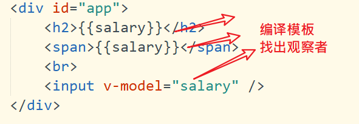
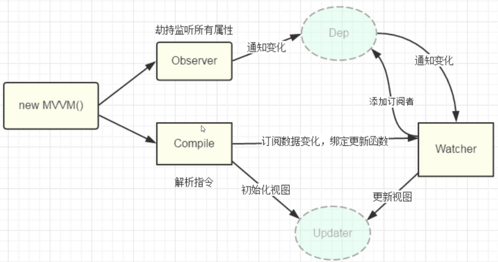

基础知识


- definedProperty
- dom节点类型
- str.replace(正则，回调)
- Object.assign()


目标：

- 实现数据双向绑定功能。
- 更深理解mvvm模型，数据驱动视图。


m：model:数据,模型

v：view:视图

vm: 视图模型


## 理解vuejs中的双向绑定

- 从数据到视图。当数据变化时，视图也跟着变化。


从视图到数据。


## mvvm与vuejs

mvvm是一种设计模式。是实现数据双向绑定的一种方式。

vue体现了mvvm的设计思想。


## 整体思路

### 从数据到视图

两个阶段：

- **最初始时，把要对象中的属性值显示在视图上。**
- 当属性变化时，视图也要变。

现象：

​	当对象中的某个属性变化时，页面上用到了这属性的dom都要变化。举个例子。


实现技术：

- 数据拦截：侵入到到数据内部，当数据（对象的属性值）发生变化时，我们可以得知。在它们变化时，发布这个通知。

- 编译模板：分析出哪些dom是依赖于哪些数据的变化的。即当前数据变化时，它们要跟着变化。这里就要用到观察者模式。

### 从视图到数据

一般只有表单元素才提供输入功能，所以只需要在表单元素中添加对应的dom事件，再去回调函数中修改数据。

## 基本构造器

目标：

- 写出构造器的基本架子，完成参数传递与获取；
- 能过数据拦截：
  - 在代码外部，让MVVM实例可以操作data选项中的属性。
  - 在代码内部，能通过`this.属性名` 的方式去操作data选项中的属性。

```javascript
function MVVM(options) {
    //1. 数据拦截。
    //    - 能让vm.salary可以访问到options.data.salary
    //    - 能让this.salary可以访问到options.data.salary
    const {data} = options

    for(let key in data) {
        Object.defineProperty(this,key,{
            get() {},
            set(val) {
                if(val != data[key]){
                    console.log(`${key}被修改了`)
                    data[key] = val;
                }
            }
        })
    }
    
    // 测试：在内部可以通过this.属性名来直接访问数据
    this.salary = -1
}

var data = {
    salary: 10000,
    bonus: 50000
};
var vm = new MVVM({
    el: "#app",
    data
});
// 测试数据劫持效果。
vm.bonus = 10000; // 
console.log(data)
```


接下来就要实现从数据到视图的变化了。


## 模板编译



整体目标：遍历dom，依次找出所有的dom节点，对它们做两件事：

- 解析显示值。找出{{message}}，赋值为1000。
- 成为观察者。当这个属性变化时，可以再次去更新。


由于这个部分的功能也比较复杂，所以，额外新建一个构造器，来完这个部分的功能。

### 创建构造器

```javascript
function Compiler(el,vm){
    this.vm = vm
    const domEL =document.querySelector(el)
    this.compile(domEL)
}
Compiler.prototype.compile = function(el){
    // 获取 el下所有的子节点，循环遍历处理
    console.log(el.childNodes)
    node.nodeType == 3; // 文本节点
    node.nodeType == 1;// 元素节点
}

```

- 注意，节点也包含换行符号。


### 编译不同类型的节点

由于在处理不同类型节点时要做的工作不同，所以在原型上补充两个方法分别来处理不同类型的节点。


```javascript
function Compiler(el){
    const domEL =document.querySelector(el)
    this.compile(domEL)
}
Compiler.prototype.compile = function(el){
    // 获取 el下所有的子节点，循环遍历处理
    console.log(el.childNodes)
    //node.nodeType == 3; // 文本节点
    //node.nodeType == 1;// 元素节点
    el.childNodes.forEach(node => {
        if(node.nodeType === 3) {
            this.compileText(node)
        } else if(node.nodeType === 1) {
            this.compileElement(node)
        }
    })
}
Compiler.prototype.compileText = function(node) {
    console.log(`当前要编译的文本节点是`,node)
}
Compiler.prototype.compileElement = function(node) {
    console.log(`当前要编译的元素节点是`,node)
}
```

测试代码的效果

在浏览器的控制台中，使用`new Compiler('#app')`来查看效果。


### 递归遍历

对于如下节点:

```html
<ul>
    <li>{{salary}}</li>
    <li>2</li>
</ul>
```

存在着元素结节嵌套的情况：

- ul标签是一个元素节点。它有5个子节点。
  - 第1个： 第一个li标签前的空白，这是一个文本节点 。
  - 第2个：第一个li标签。它是元素节点。
  - 第3个：第一个li和第二个li之间的空白。这是一个文本节点。
  - 第4个：第二个li。它是元素节点。
  - 第5个：第二个li后与`</ul>`之间的空白。这是一个文本节点。

很显然，我们需要对元素节点再做一次遍历。

处理的方式也非常简单：加一句代码即可

```javascript
Compiler.prototype.compile = function(el){
    // 获取 el下所有的子节点，循环遍历处理
    // console.log(el.childNodes)
    el.childNodes.forEach(node => {
        if(node.nodeType === 3) {
            this.compileText(node)
        } else if(node.nodeType === 1) {
            this.compileElement(node)
+           this.compile(node)
        }
    })
}
```


### 编译文本结点

对于文本结点，只需要关注是否有{{}}表达式，如果有的话，就赋值，否则就不做处理。

#### 目标

```html
<div>salary:{{salary}},bonus:{{bonus}}</div>
```

解析成：

```html
<div>salary:10000, bonus:5000</div>
```


#### 思路

- 取出文本内容，使用正则匹配`{{}}`
- 做替换


#### 实现

技术：字符串的replace方法+正则表达式

```javascript
Compiler.prototype.compileText = function(node) {
    console.log(`当前要编译的文本节点是`,node)
    var str = node.textContent
    var newstr = str.replace(/{{(.+?)}}/g,function(match,$1){ 
        return this.vm[$1];
    })
    node.textContent = newstr;
    console.log('处理之后的元素结节是',newstr)
}
```

### 编译元素结点

对于元素结点，只需要关注是否有v-bind,v-model等属性。

思路：

对元素结点，获取这个结点上所有的属性，如果有v-model(或者其它于v-bind,v-if....)属性，就要做两件事情。

- 显示初值。
- 添加观察者。

对于如下元素结点，

```html
<input type="text" v-model="salary" />
```

我们关注是否包含v-model属性，最后要把v-model的值取出来，并给显示出来。

```javascript
Compiler.prototype.compileElement = function(node) {
    console.log(`当前要编译的元素节点是`,node,node.attributes);
    console.log(`当前要编译的元素节点是`,node,node.attributes);
    if( node.hasAttribute("v-model") ) {
        let exp = node.getAttribute("v-model");
        console.log(node)
        node.value = this.vm[exp]

        node.addEventListener("input", e => {
            console.info("input change.....", e);
            this.vm[exp] = e.target.value;
        });

        em.addListener(exp,()=>{
            node.value = this.vm[exp]
        })
    }
}
```


## 数据变化反映到视图

下面要实现的目标是当数据变化时，及时去更新视图。一个数据的变化可能会引起多处视图的变化。

### 分析

以下面的视图为例:

- 当salary变化时，下面的三处dom都要改变
- 当bouns变化时，有一处dom要变化

```html
<div>
	<h1> {{salary}} </h1>
	<input v-model="salary" />
	<ul>
		<li>{{salary}}</li>
		<li>{{bouns}}</li>
	</ul>
</div>
```


可以使用观察者模式：

- 把属性名当成事件名
- 每一个结点都是观察者

| 序号 | 事件名 | 观察者                       | 动作     |
| ---- | ------ | ---------------------------- | -------- |
| 1    | salary | `<h1> {{salary}} </h1>`      | 更新自已 |
| 2    | salary | `<input v-model="salary" />` | 更新自已 |
| 3    | salary | `<li>{{salary}}</li>`        | 更新自已 |
| 4    | bouns  | `<li>{{bouns}}</li>`         | 更新自已 |


### 步骤

- 引入观察者代码
- 在数据变化时去发布事件
  - 在数据劫持时，给set方法中 添加代码，来发布事件
- 在模板编译时去监听事件
  - 在compile方法中，添加观察者。


#### 引入观察者代码

```javascript
<script type="text/javascript">
function EventEmitter () {
    // this.subs = [{事件名:[处理函数1，处理数2,...]}]
    this.subs = {}
}
EventEmitter.prototype.addListener = function(eventType, callback) {
    this.subs[eventType] = this.subs[eventType] || []
    this.subs[eventType].push(callback)
}
EventEmitter.prototype.fire = function(eventType) {
    this.subs[eventType] && this.subs[eventType].forEach(callback => {
        callback()
    })
}
</script>
```

上面的代码已经在前面单独学习过，这里就不再展开。

单独实例化一个事件管理者。

```javascript
var em = new EventEmitter()
```

#### 在数据变化时去发布事件

```javascript

<script type="text/javascript">
function MVVM(options) {
    //1. 数据劫持。
    // 能让vm.message可以访问到options.data.message
    const {data,el} = options

    for(let key in data) {
        Object.defineProperty(this,key,{
            get() {
                return data[key]
            },
            set(value) {
                if(value != data[key]){
                    console.log(`${key}被修改了`)
                    data[key] = value
                    em.fire(key)
                }
            }
        })
    }

    new Compiler(el,this)
}
```

#### 在模板编译时去监听事件

##### 修改文本编译

对形如`工资是：{{salary}},奖金是：{{bouns}}` 这样的文本节点来说，

当vm.salary和vm.bouns的值变化时，它都会变化。

也就是说，它要观察两个属性，应该添加两个观察者。

所以，这里的观察者需要通过循环来添加。

```javascript
Compiler.prototype.compileText = function(node) {
	
    // console.log(`当前要编译的文本节点是`,node)
    // 编译器只执行一次，它要做两件事：
    // 1. 给节点赋初值
    // 2. 添加观察者。当 数据变化时，它能自动更新
    let str = node.textContent;
+   let set = new Set()
    node.textContent = str.replace(/{{(.+?)}}/g,(match,$1)=>{ 
        let key = $1.trim()

        console.log(this.vm,key,this.vm[key]);
        set.add(key);
        return  this.vm[key]
    })
    console.log('处理之后的元素结节是',node.textContent)
    Array.from(set).forEach((key)=>{
        em.addListener(key,()=>{
            node.textContent = str.replace(/{{(.+?)}}/g,(match,$1)=>{ 
                let key = $1.trim()
                return  this.vm[key]
            })
        })
    })
}
```


##### 元素节点编译

添加观察者。

```javascript
Compiler.prototype.compileElement = function(node) {
    console.log(`当前要编译的元素节点是`,node,node.attributes);

    if( node.hasAttribute("v-model") ) {
        let exp = node.getAttribute("v-model");
        console.log(node)
        node.value = this.vm[exp]


        em.addListener(exp,()=>{
            node.value = this.vm[exp]
        })
    }
}
```


### 测试

```javascript

<script>
    var data = {
        salary: 10000,
        bonus: 50000
    };
var vm = new MVVM({
    el: "#app",
    data
});

</script>
```

在控制台中直接修改vm.salary和bonus的值来观察视图上的变化。


## 从视图到数据

用户在视图上的修改也应该反映在数据上。

这里主要是input:type="text"元素。

只需要在处理v-model时，给input框添加input事件

```javascript
Compiler.prototype.compileElement = function(node) {
    console.log(`当前要编译的元素节点是`,node,node.attributes);
    console.log(`当前要编译的元素节点是`,node,node.attributes);
    if( node.hasAttribute("v-model") ) {
        let exp = node.getAttribute("v-model");
        console.log(node)
        node.value = this.vm[exp]

        node.addEventListener("input", e => {
            console.info("input change.....", e);
            this.vm[exp] = e.target.value;
        });

        em.addListener(exp,()=>{
            node.value = this.vm[exp]
        })
    }
}
```


## 支持函数

目标：

在如下代码中，目标 是希望button上的click能够使用。

```html
<button @click="hDouble">加倍</button>
<script>
	var data = {
        salary: 10000,
        bonus: 50000
    };
    var vm = new MVVM({
        el: "#app",
        data,
        methods: {
            hDobule() {
                this.salary *= 2;
            }
        }
    });
</script>
```

### 思路

- 模板编译时，如果发现有@click属性，则添加对应的dom事件，调用函数。
- 把@click的属性值，挂到vm对象上，以方便调用。


### 步骤

- 把函数附加到实例上。

- 在编译节点时，如果发现@click属性，则添加对应的事件

#### 把函数附加到实例上

```javascript
function MVVM(options) {
    // ...
    Object.assign(this,options.methods)
}
var vm = new MVVM({
    el: "#app",
    data,
    methods: {
        hDobule() {
            this.salary *= 2;
        }
    }
});
```

>  Object.assign()

测试：

在控制台中通过vm.hDouble() 来访问。


```javascript
Compiler.prototype.compileElement = function(node) {
    console.log(`当前要编译的元素节点是`,node,node.attributes);
    if( node.hasAttribute("v-model") ) {
        let exp = node.getAttribute("v-model");
        console.log(node)
        node.value = this.vm[exp]

        node.addEventListener("input", e => {
            console.info("input change.....", e);
            this.vm[exp] = e.target.value;
        });

        em.addListener(exp,()=>{
            node.value = this.vm[exp]
        })
    }
    if(node.hasAttribute('@click')) {
        let exp = node.getAttribute("@click");
        node.addEventListener("click", () => {
            this.vm[exp]();
        });
    }	
}
```




## 补充：复习dom节点

### dom节点类型

DOM是javascript操作网页的接口，全称为文档对象模型(Document Object Model)。它的作用是将网页转为一个javascript对象，从而可以使用javascript对网页进行各种操作(比如增删内容)。浏览器会根据DOM模型，将HTML文档解析成一系列的节点，再由这些节点组成一个树状结构。DOM的最小组成单位叫做节点(node)，文档的树形结构(DOM树)由12种类型的节点组成。

一般地，节点至少拥有nodeType、nodeName和nodeValue这三个基本属性。节点类型不同，这三个属性的值也不相同

**nodeType**

```
元素节点            　　Node.ELEMENT_NODE(1)
属性节点            　　Node.ATTRIBUTE_NODE(2)
文本节点            　　Node.TEXT_NODE(3)
CDATA节点             Node.CDATA_SECTION_NODE(4)
实体引用名称节点    　　 Node.ENTRY_REFERENCE_NODE(5)
实体名称节点        　　Node.ENTITY_NODE(6)
处理指令节点        　　Node.PROCESSING_INSTRUCTION_NODE(7)
注释节点            　 Node.COMMENT_NODE(8)
文档节点            　 Node.DOCUMENT_NODE(9)
文档类型节点        　　Node.DOCUMENT_TYPE_NODE(10)
文档片段节点        　　Node.DOCUMENT_FRAGMENT_NODE(11)
DTD声明节点            Node.NOTATION_NODE(12)
```


### 元素节点

[元素节点element](http://www.cnblogs.com/xiaohuochai/p/5819638.html)对应网页的HTML标签元素。

- 类型nodeType值是1
- 名称nodeName值是大写的标签名
- nodeValue值是null

以body元素为例

```javascript
console.log(document.body.nodeType,document.body.nodeName,document.body.nodeValue)
console.log(Node.ELEMENT_NODE === 1);//true
```


### 文本节点

[文本节点text](http://www.cnblogs.com/xiaohuochai/p/5815193.html)代表网页中的HTML标签内容。

- 节点类型nodeType值是3 
- 节点名称nodeName值是'#text' 
- nodeValue值是 内容值
- 通过textContent 设置文本节点的内容

```html
<h1 id="h1"><span>h1中的span</span>h1中的文本节点</h1>
```

问题：

如何把 "h1中的文本节点" 修改成 "哈哈哈"


下面是javascript代码:

```javascript
var txt = document.getElementById("h1").firstChild;
console.log(txt.nodeType,txt.nodeName,txt.nodeValue)
console.log(Node.TEXT_NODE === 3);//true    
```


### 特性节点

元素[特性节点attribute](http://www.cnblogs.com/xiaohuochai/p/5820076.html)对应网页中HTML标签的属性，它只存在于元素的attributes属性中，并不是DOM文档树的一部分。

- 节点类型nodeType值是2
- 节点名称nodeName值是属性名
- nodeValue值是属性值

测试代码如下：

```html
<div id="test"></div>
<script>
var attr = test.attributes.id;
//2 'id' 'test'
console.log(attr.nodeType,attr.nodeName,attr.nodeValue)
console.log(Node.ATTRIBUTE_NODE === 2);//true    
</script>
```


 

## 补充: 复习字符串的replace方式


### 难点突破

问题描述，在如下代码中，

```javascript
// 问题描述，在如下代码中，如何获取
var obj = {a : 1, b :200}
var str = "a的值是{{a}},b的值是{{b}}"
// 写你的代码，完成目标：
// var newStr = 
console.log(newStr); // "a的值是1, b的值是2"
```


[String.prototype.replace](https://developer.mozilla.org/zh-CN/docs/Web/JavaScript/Reference/Global_Objects/String/replace)

```javascript
字符串.replace(正则表达式,回调函数);
回调函数的格式说明如下：
function(匹配到的子串，p1,p2,...pn, 匹配到的子串在原字符串中的位置，原字符串){
    // .... 
    // p1,p2...pn 表示在正则表达式中第n个括号匹配的字符串。
    return 替换匹配到的子串的新内容
}
```


| 变量名       | 代表的值                                                     |
| ------------ | ------------------------------------------------------------ |
| `match`      | 匹配的子串。（对应于上述的$&。）                             |
| `p1,p2, ...` | 假如replace()方法的第一个参数是一个[`RegExp`](https://developer.mozilla.org/zh-CN/docs/Web/JavaScript/Reference/RegExp) 对象，则代表第n个括号匹配的字符串。（对应于上述的$1，$2等。）例如，如果是用 `/(\a+)(\b+)/` 这个来匹配，`p1` 就是匹配的 `\a+`，`p2` 就是匹配的 `\b+`。 |
| `offset`     | 匹配到的子字符串在原字符串中的偏移量。（比如，如果原字符串是 `'abcd'`，匹配到的子字符串是 `'bc'`，那么这个参数将会是 1） |
| `string`     | 被匹配的原字符串。                                           |

```javascript
str.replace(/({{(.+?)}})/g,function($1,$2){ console.log($1,$2)})
```

